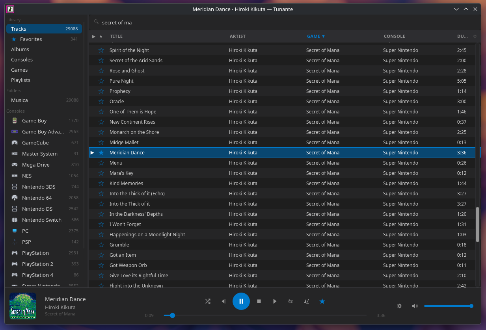

# Tunante



*I have codevibed this to understand how replaceable I am as a programmer.*

A cross-platform music player focused on video game music formats, inspired by foobar2000.

Built with [Slint](https://slint.dev/) and Rust. One binary, every screen: a
wide window is a desktop player with sidebar, track table and queue; a narrow
one is a phone player built for a thumb. No web view, no JavaScript engine —
it draws straight to the GPU through GLES2.

> The first desktop app was Tauri v2 + SvelteKit. It was retired once the
> Slint player reached parity (`docs/plan-desktop-slint.md` tells the whole
> story); its last release is
> [v0.1.283](https://github.com/jjolmo/tunante/releases/tag/v0.1.283).


## Features

- **Standard audio**: MP3, FLAC, OGG Vorbis, WAV, AAC, AIFF, WMA, M4A, Opus, APE, WavPack
- **Chiptune / GME**: NSF, NSFE, SPC, GBS, VGM/VGZ, HES, KSS, AY, SAP, GYM — with auto-fade for looping tracks
- **PSF family**: PSF (PS1), PSF2 (PS2), GSF (GBA), 2SF (NDS), NCSF (NDS), USF (N64), SSF (Saturn), DSF (Dreamcast), QSF (Capcom QSound) — each with its `mini` variant, played by the original emulator cores
- **Game audio containers**: ADX, HCA, DSP, FSB, WEM, BCSTM, BFSTM, BRSTM, NUS3BANK, AT3/AT9, XMA, SCD, and 700+ formats via vgmstream

### Game music, treated as game music

- **Box art downloader**: Finds the real cover for a game and writes it next to
  the music. Matches against the [libretro-thumbnails](https://github.com/libretro-thumbnails)
  `Named_Boxarts` index — the same canonical No-Intro name list emulator frontends
  use — and falls back to iTunes, Steam, Deezer, Nintendo and Wikipedia for
  soundtracks no console archive carries.
- **Matching that refuses rather than guesses**: normalisation folds accents,
  articles and roman/arabic numerals, then six ranked match stages with an
  ambiguity guard. When the runner-up is within a hair of the winner it declines,
  because a wrong cover written into a synced folder is worse than no cover.
  `Mega Man X` stays X and does not become `Mega Man 10`.
- **A cover picker**: when the automatic answer is wrong because the *name* is
  wrong, type a better one and choose among every candidate by eye.
- **Console detection**: Every track gets a console from its format and its place
  in the library. `.spc` *is* SNES wherever it sits; `.vgm` names no machine, so
  the folder wins. 32 consoles in one table shared by both apps.
- **Game detection**: The game name comes from the ID666/tag album when it has
  one — which rescues abbreviated rips like `ct/` or `ff6/` — and from the folder
  when the tag names the soundtrack rather than the game.
- **Fix what it got wrong**: Per-track and per-folder overrides that survive a
  rescan, right from the track table's context menu.
- **Auto-fade for looping tracks** and a configurable loop count for formats that
  never end on their own.

### Player and library

- **Decoding out of process**: the emulator cores run in a separate
  `tunante-decoder` binary that returns PCM over a pipe. A malformed rip that
  kills a decoder cannot take the player down, and the ~40 MB an NDS core
  allocates goes away with the process the moment the track changes.
- **Library**: folder scanning (parallel, killable), a folder watcher that keeps
  it fresh, full-text search with accent folding, five phone views (tree, discs,
  consoles, games, playlists) and a sortable, filterable track table on desktop
- **Playlists**: create, rename, delete, reorder, build one from a folder
- **Ratings / Favorites**: star column, one click to rate — stored in the
  database and written to the file tag or the folder's `_ratings.m3u` following
  a configurable priority
- **Queue**: visible at all times on desktop, reorder by drag, enqueue from
  anywhere ("and then this one")
- **DSP chain**: three-band equaliser, preamp, limiter and mono fold-down,
  audible on the track already playing
- **Output device selection** with recovery when the device dies (Bluetooth,
  unplugs) or the system default moves
- **System tray** (Linux), **MPRIS** lock-screen/headset controls, sleep timer,
  logind sleep inhibitor while playing
- **Single instance**: a second launch focuses the first; opening a file from a
  file manager hands it to the running player
- **Metadata editor** from the context menu
- **Self-updating**: from Ajustes, or headless with `tunante-mini --update`

## Prerequisites (building from source)

- **Rust** stable toolchain (1.85+) — install via [rustup](https://rustup.rs/)
- **CMake** and a **C/C++ compiler** — required for the vendored audio cores

```bash
# Ubuntu / Debian
sudo apt install build-essential pkg-config cmake \
  libfontconfig1-dev libasound2-dev zlib1g-dev \
  libgtk-3-dev libappindicator3-dev

# Fedora
sudo dnf install gcc-c++ cmake pkg-config \
  fontconfig-devel alsa-lib-devel zlib-devel \
  gtk3-devel libappindicator-gtk3-devel
```

GTK is only for the tray icon's own thread — the app itself is winit — and the
phone builds compile without it (`--no-default-features`).

## Quick Start

```bash
# Clone with submodules (vgmstream is a git submodule)
git clone --recurse-submodules https://github.com/jjolmo/tunante.git
cd tunante

# Build and run the desktop shell (the decoder must exist as a sibling)
cargo build --release -p tunante-decoder
cargo run --release -p tunante-mini -- --desktop
```

`--mini` forces the phone shell; with neither flag the window's width decides.
If you already cloned without `--recurse-submodules`:

```bash
git submodule update --init --recursive
```

## Installation

Grab the newest [release](https://github.com/jjolmo/tunante/releases):

| Asset | For |
|-------|-----|
| `tunante-mini-x86_64-linux-gnu.tar.gz` | An ordinary desktop or laptop |
| `tunante-mini-aarch64-linux-gnu.tar.gz` | ARM boards, ARM laptops, an ARM desktop |
| `tunante-mini-x86_64-windows.zip` | Windows |
| `tunante-mini-*-r0.apk` (Alpine, musl, aarch64) | postmarketOS and any Alpine phone |
| `tunante-android-*.apk` | Android — see below |

Unpack the tarball anywhere and run `tunante-mini`. It self-updates from then
on (Ajustes → Buscar actualizaciones, or `tunante-mini --update` from a cron
job). Each tarball carries both `tunante-mini` and `tunante-decoder`, and they
must stay side by side: the player looks for the decoder as a sibling of
itself, and splitting them breaks playback with a message that does not
explain why.

It needs fontconfig, ALSA and a working GL driver at runtime — all dlopened,
so a machine that lacks one says so rather than failing to start. MPRIS and
the sleep inhibitor are freedesktop specifications, so on Windows those are
compiled out and everything else is the same code.

**Coming from the old Tauri desktop?** Unpack the tarball and run it: it opens
the same library and settings (it adopts the old app's database on first
start). The move is by hand exactly once; updates take care of themselves
afterwards.

**macOS**: the new stack has not been built for macOS yet; the last Tauri
release ([v0.1.283](https://github.com/jjolmo/tunante/releases/tag/v0.1.283))
still works there, quarantine dance included (`xattr -cr /Applications/Tunante.app`).

## tunante-android

A native Android app: Kotlin and Jetpack Compose for the interface, with the
whole Rust half compiled into a `cdylib` and reached over JNI. Playback,
database, decoding and classification are the same code the desktop runs; only
the screen is different.

```bash
cd apps/android && ./build.sh     # both ABIs
ABIS="arm64-v8a" ./build.sh       # phone only, skips the emulator build
```

Needs `ANDROID_NDK_HOME` and a JDK 17+. The APK is at
`apps/android/app/build/outputs/apk/`, and signed builds are attached to
[Releases](https://github.com/jjolmo/tunante/releases).

**Sideload only, and it will stay that way.** The app asks for
`MANAGE_EXTERNAL_STORAGE`, which Google Play forbids to media players. That is
not laziness: under the permission Play does allow, `MediaProvider` decides file
by file from a MIME map that has never heard of `.psf`, `.nsf`, `.spc`, `.gsf`
or `.2sf`. Those files are not indexed, so they cannot be opened — `readdir()`
does not even list them. A normal music player never notices. This one does not
work at all.

## Project Structure

Two apps under `apps/`, what they share under `crates/`, third-party C under
`vendor/`. The Cargo workspace root is the repository root.

```
apps/mini/                    # The player (Slint): desktop shell + phone shell
apps/android/                 # Android app (Gradle, Kotlin, Compose)
  rust/                       #   Its JNI half (cdylib)

crates/tunante-core/          # SQLite layer, play queue, session, DSP, classification
crates/tunante-audio/         # Playback engine: device selection, recovery, DSP over the pipe
crates/tunante-codec/         # Decoders and metadata readers — linked only by the decoder
crates/tunante-decoder/       # Out-of-process decoder binary: probe, play, art, rate
crates/tunante-helper/        # Client for it: probe, artwork, rate, scan, folder watch
crates/tunante-art/           # Cover art: matching, download, storage

vendor/game-music-emu-patch/  # Patched game-music-emu (C++ chiptune emulation)
vendor/vgmstream/             # vgmstream submodule (C, game audio decoding)
vendor/vgmstream-rs/          # Rust bindings for vgmstream
vendor/hepsf-rs/              # PSF/PSF2 playback (C, Highly Experimental + sexypsf)
vendor/vio2sf-rs/             # 2SF playback (C, vio2sf + DeSmuME core)
vendor/viogsf-rs/, viogsf/    # GSF playback (C, VBA-M)
vendor/lazyusf2-rs/           # USF playback (C, N64 core)
vendor/opus-decoder-patch/    # Pure Rust Opus decoder (patched)
```

`assets/logo.png` is the only drawing in the repository. All 20 icons —
tunante-mini's hicolor set, Android's launcher and adaptive mipmaps — are
generated from it by `scripts/gen-icons.py`, checked in CI, and never edited
by hand.

None of the shared crates may depend on a GUI toolkit. The moment a second app
needs something, it moves down into a crate rather than being copied —
`decoder.rs`, `scan_folder`, `folder_image`, `session.rs`, `DspConfig` and the
whole `AudioEngine` all made that trip.

## Other Commands

```bash
# Check Rust code (from the repository root)
cargo check --workspace --all-targets --exclude tunante-android

# The format smoke test: every emulator backend decodes a real fixture
cargo test -p tunante-codec -p tunante-decoder --release

# The phone configuration (no tray, no updater, no GTK)
cargo build --release --no-default-features -p tunante-mini
```

## Tech Stack

| Component | Technology |
|-----------|-----------|
| UI | [Slint](https://slint.dev/) (winit backend, femtovg/GLES2 with a software fallback) |
| Audio output | [rodio](https://github.com/RustAudio/rodio) |
| Chiptune emulation | [game-music-emu](https://github.com/gme-rs/game-music-emu-rs) (C++) |
| Game audio decoding | [vgmstream](https://github.com/vgmstream/vgmstream) (C) |
| PSF/PS1 playback | sexypsf + Highly Experimental (C) |
| GSF/GBA playback | VBA-M core (C) |
| 2SF/NDS playback | vio2sf + DeSmuME core (C) |
| USF/N64 playback | lazyusf2 (C) |
| Opus decoding | Pure Rust (patched [Rusopus](https://github.com/TadeuszWolfGang/Rusopus)) |
| Metadata | [lofty](https://github.com/Serial-ATA/lofty-rs) |
| Database | [rusqlite](https://github.com/rusqlite/rusqlite) (SQLite, bundled) |
| Concurrency | [parking_lot](https://github.com/Amanieu/parking_lot) |

## FAQ

**"Why you built it?"**

First of all: I didn't do shit, I just prompted it. My creative coding happens on gamedev which is the only place I'm happy to code like we did in 2022. I built this because Foobar2000 with videogame plugins does not work on Linux and Mac. And I was tired of trying to emulate it with Wine. I tried [Cog](https://github.com/losnoco/Cog) also for Mac but it was crashing like hell with my library and doesn't cover all my consoles. Then [Fooyin](https://github.com/fooyin/fooyin) only works on Linux so I really needed something that worked on Mac because I use them in my paid fulltime work. And also it doesn't include all the videogame libraries and is not able to handle all my collection, again because it crashes. So here we are.

**"I have found a bug, what should I do?"**

Create a PR, or fork it and fix it, I don't care anymore. Software development is dead, and my time is more expensive to just ask the AI to fix things when you can also contribute.

**"But it's codevibed shit, is it secure?"**

I don't know, ask Copilot, they know all the answers it seems, even a comprehensive guide about how to be a plumber.

**"I need this feature"**

Fork it or open a PR. I'll decide if I want to ship it or not. This app is meant to be customized for me with minimal elements to make it faster. Anyway in the near future you won't need a stupid GitHub to get an app. You will vibecode it on demand and dedicate the rest of your time to do creative tasks like washing your dishes or do your laundry.

**"Format doesn't work?"**

Send me an example. I'll just tell the AI to do it so I can go to the fucking fuck anywhere and keep learning how to unclog a WC.

**"How much it took to build first 'stable' version?"**

2 days, while I was watching youtube videos to decide if I should sell all my stock before meltdown happens.

**"How many lines were made by human hand?"**

0 (Zero). So you can start reflecting now what kind of future we're moving towards ☀️

**"Why do I need that crap command to run it on macOS?"**

I don't know... ask Apple why we need to pay a fucking $1,00 yearly subscription to release an app without adding paranoid notes saying my app might destroy your family and delete pizza from Earth. The same goes for Windows. I don't have Windows to check if it works. So if it does, send a message, and I'll update the readme. But I guess you will need to authorise opening an "insecure app". I'm not going to give a penny to those fucking extortionists.

**"Do I need this app?"**

Only if you want a multiplatform app that reads almost all video game formats. Otherwise please search for a more serious player that was made by human hearts instead of this idiotic amalgam of data.

## License

This project is licensed under the **GNU General Public License v2.0** — see the [LICENSE](LICENSE) file for details.

GPL v2 is required because the project statically links GPL-licensed C/C++ libraries (sexypsf, DeSmuME, MAME YM2612 emulator).
